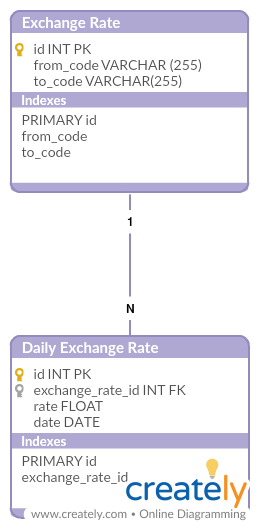

# Exchange Rate

## Repository stats

|          |                                                                                                                                                       |
| -------- | ----------------------------------------------------------------------------------------------------------------------------------------------------- |
| Pipeline | [](https://gitlab.com/rizaldntr/shopee-exchange-rate) |
| Coverage | [](https://gitlab.com/rizaldntr/shopee-exchange-rate) |

## Database Design



## Onboarding and Development Guide

### Requirement

- [Docker Compose] - Compose is a tool for defining and running multi-container Docker applications.

### Getting Started For Local or Staging

#### Install Docker Compose

1. Run this command to download the latest version of Docker Compose:
   ```
   sudo curl -L "https://github.com/docker/compose/releases/download/1.23.2/docker-compose-$(uname -s)-$(uname -m)" -o /usr/local/bin/docker-compose
   ```
2. Apply executable permissions to the binary:
   ```
   sudo chmod +x /usr/local/bin/docker-compose
   ```
3. Test the installation:
   `docker-compose --version`
   For more information check [this](https://docs.docker.com/compose/install/).

   [Docker Compose]: <https://docs.docker.com/compose/>

#### How to run the apps

1. Copy env from .env.sampe to .env:
   ```
   cp .env.sample .env
   ```
2. Run the apps using docker-compose:
   ```
   docker-compose up -d --build
   ```

### FAQ

TODO
